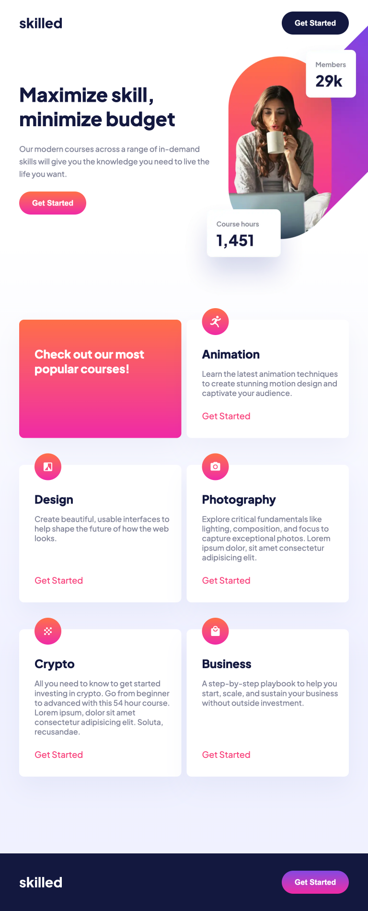
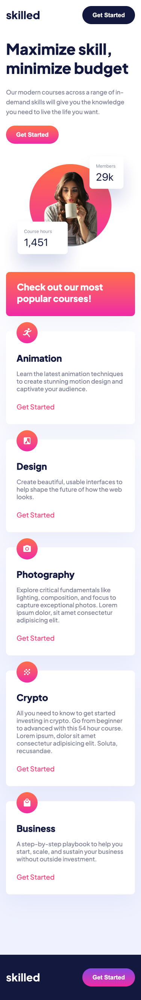

# Frontend Mentor - Skilled e-learning landing page solution

This is a solution to the [Skilled e-learning landing page challenge on Frontend Mentor](https://www.frontendmentor.io/challenges/skilled-elearning-landing-page-S1ObDrZ8q). Frontend Mentor challenges help you improve your coding skills by building realistic projects.

## Table of contents

- [Overview](#overview)
  - [The challenge](#the-challenge)
  - [Screenshot](#screenshot)
  - [Links](#links)
- [My process](#my-process)
  - [Built with](#built-with)
- [Author](#author)

## Overview

### The challenge

Users should be able to:

- View the optimal layout depending on their device's screen size
- See hover states for interactive elements

### Screenshot

Desktop

Tablet

Mobile

### Links

- Solution URL: [GitHub](https://github.com/maeve-du/skilled-elearning-landing-page-FMChallenges-02)
- Live Site URL: [GitHub Pages](https://maeve-du.github.io/skilled-elearning-landing-page-FMChallenges-02/)

## My process

### Built with

- Semantic HTML5 markup
- CSS custom properties
- Flexbox
- CSS Grid
- Mobile-first workflow
- Pixel Perfect
- Responsive

## Author

- Github - [@maeve-du](https://github.com/maeve-du)
- Frontend Mentor - [@maeve-du](https://www.frontendmentor.io/profile/maeve-du)

